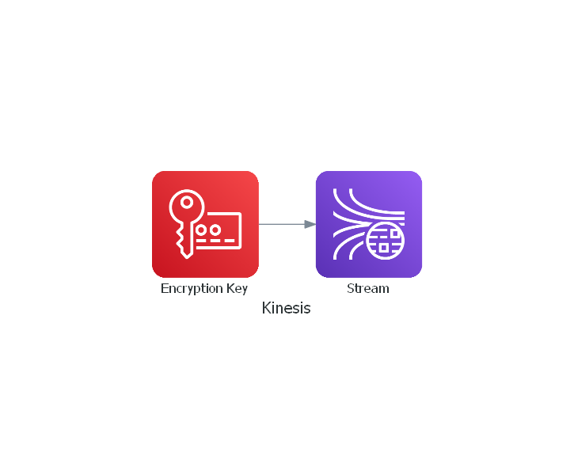

# terraform-aws-kinesis-stream

[](https://github.com/JamesWoolfenden/terraform-aws-kinesis-stream)
[](https://github.com/JamesWoolfenden/terraform-aws-kinesis-stream/releases/latest)
[](https://github.com/JamesWoolfenden/terraform-aws-kinesis-stream/releases/latest)

[](https://www.bridgecrew.cloud/link/badge?vcs=github&fullRepo=JamesWoolfenden%2Fterraform-aws-kinesis-stream&benchmark=CIS+AWS+V1.2)
[](https://github.com/pre-commit/pre-commit)
[](https://www.checkov.io/)
[](https://www.bridgecrew.cloud/link/badge?vcs=github&fullRepo=JamesWoolfenden%2Fterraform-aws-kinesis-stream&benchmark=INFRASTRUCTURE+SECURITY)

This has an example for how to add a custom Checkov check:
Create a folder for your checks:

```cli
$ mkdir checkov
...
```

Add **init**.py

```python
from os.path import dirname, basename, isfile, join
import glob
modules = glob.glob(join(dirname(__file__), "*.py"))
__all__ = [ basename(f)[:-3] for f in modules if isfile(f) and not f.endswith('__init__.py')]
```

And your resource check **checkov\KinesisStreamEncryptionType.py**:

```python
from checkov.common.models.enums import CheckResult, CheckCategories
from checkov.terraform.checks.resource.base_resource_check import BaseResourceCheck


class KinesisStreamEncryptionType(BaseResourceCheck):
    def __init__(self):
        name = "Ensure Kinesis Stream is securely encrypted"
        id = "CKV_AWS_999"
        supported_resources = ['aws_kinesis_stream']
        categories = [CheckCategories.ENCRYPTION]
        super().__init__(name=name, id=id, categories=categories, supported_resources=supported_resources)

    def scan_resource_conf(self, conf):
        if "encryption_type" in conf.keys():
            if (conf["encryption_type"][0] == "KMS"):
                return CheckResult.PASSED
            else:
                return CheckResult.FAILED
        else:
            return CheckResult.FAILED


check = KinesisStreamEncryptionType()
```

And finally run your new check:

```cli
$ checkov -d . --external-checks-dir checkov/
...
```

## Usage

This is just a very basic example.



Include **module.kinesis.tf** this repository as a module in your existing terraform code:

```terraform
module "kinesis" {
  source      = "JamesWoolfenden/kinesis-stream/aws"
  version     = "v0.1.1"
  common_tags = var.common_tags
}

```

<!-- BEGINNING OF PRE-COMMIT-TERRAFORM DOCS HOOK -->
## Requirements

No requirements.

## Providers

| Name | Version |
|------|---------|
| <a name="provider_aws"></a> [aws](#provider\_aws) | n/a |

## Modules

No modules.

## Resources

| Name | Type |
|------|------|
| [aws_kinesis_video_stream.flow](https://registry.terraform.io/providers/hashicorp/aws/latest/docs/resources/kinesis_video_stream) | resource |

## Inputs

| Name | Description | Type | Default | Required |
|------|-------------|------|---------|:--------:|
| <a name="input_kms_key_id"></a> [kms\_key\_id](#input\_kms\_key\_id) | n/a | `string` | n/a | yes |
| <a name="input_stream"></a> [stream](#input\_stream) | n/a | <pre>object({<br>    name                    = string<br>    data_retention_in_hours = number<br>    device_name             = string<br>    media_type              = string<br>  })</pre> | <pre>{<br>  "data_retention_in_hours": 1,<br>  "device_name": "kinesis-video-device-name",<br>  "media_type": "video/h264",<br>  "name": "terraform-kinesis-test"<br>}</pre> | no |

## Outputs

| Name | Description |
|------|-------------|
| <a name="output_kinesis"></a> [kinesis](#output\_kinesis) | n/a |
<!-- END OF PRE-COMMIT-TERRAFORM DOCS HOOK -->

## Policy

This is the policy required to build this project:

<!-- BEGINNING OF PRE-COMMIT-PIKE DOCS HOOK -->
The Terraform resource required is:

```golang
resource "aws_iam_policy" "terraform_pike" {
  name_prefix = "terraform_pike"
  path        = "/"
  description = "Pike Autogenerated policy from IAC"

  policy = jsonencode({
    "Version": "2012-10-17",
    "Statement": [
        {
            "Sid": "VisualEditor0",
            "Effect": "Allow",
            "Action": [
                "kinesisvideo:CreateStream",
                "kinesisvideo:DeleteStream",
                "kinesisvideo:DescribeStream",
                "kinesisvideo:ListTagsForStream",
                "kinesisvideo:TagStream",
                "kinesisvideo:UntagStream",
                "kinesisvideo:UpdateStream"
            ],
            "Resource": "*"
        }
    ]
})
}


```
<!-- END OF PRE-COMMIT-PIKE DOCS HOOK -->

## Related Projects

Check out these related projects.

- [terraform-aws-s3](https://github.com/jameswoolfenden/terraform-aws-s3) - S3 buckets

## Help

**Got a question?**

File a GitHub [issue](https://github.com/JamesWoolfenden/terraform-aws-kinesis-stream/issues).

## Contributing

### Bug Reports & Feature Requests

Please use the [issue tracker](https://github.com/JamesWoolfenden/terraform-aws-kinesis-stream/issues) to report any bugs or file feature requests.

## Copyrights

Copyright © 2019-2022 James Woolfenden

## License

[](https://opensource.org/licenses/Apache-2.0)

See [LICENSE](LICENSE) for full details.

Licensed to the Apache Software Foundation (ASF) under one
or more contributor license agreements. See the NOTICE file
distributed with this work for additional information
regarding copyright ownership. The ASF licenses this file
to you under the Apache License, Version 2.0 (the
"License"); you may not use this file except in compliance
with the License. You may obtain a copy of the License at

<https://www.apache.org/licenses/LICENSE-2.0>

Unless required by applicable law or agreed to in writing,
software distributed under the License is distributed on an
"AS IS" BASIS, WITHOUT WARRANTIES OR CONDITIONS OF ANY
KIND, either express or implied. See the License for the
specific language governing permissions and limitations
under the License.

### Contributors

[![James Woolfenden][jameswoolfenden_avatar]][jameswoolfenden_homepage]<br/>[James Woolfenden][jameswoolfenden_homepage]

[jameswoolfenden_homepage]: https://github.com/jameswoolfenden
[jameswoolfenden_avatar]: https://github.com/jameswoolfenden.png?size=150
